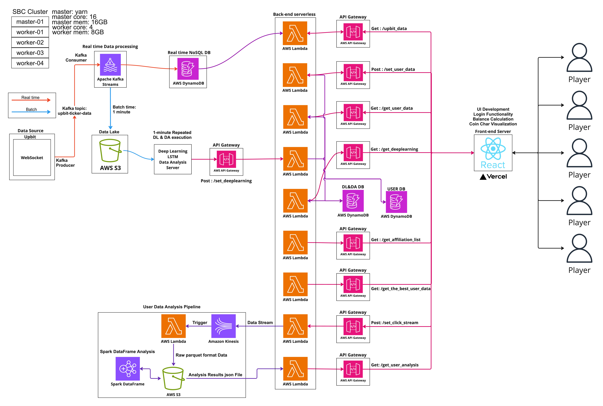
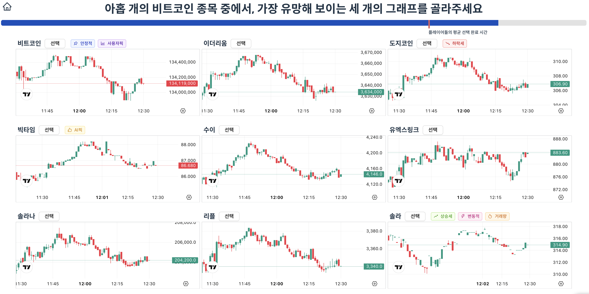
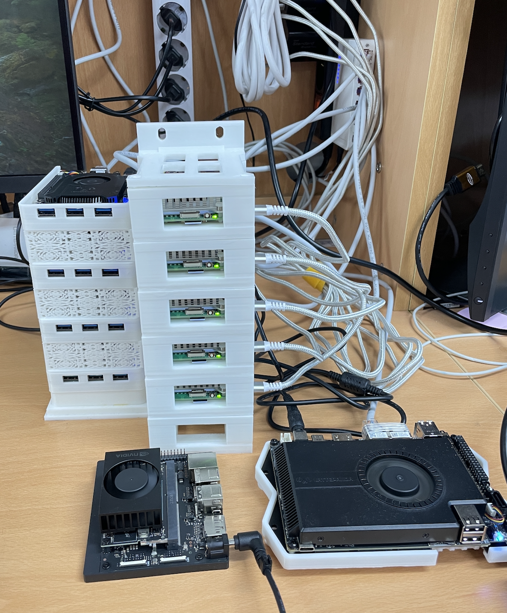
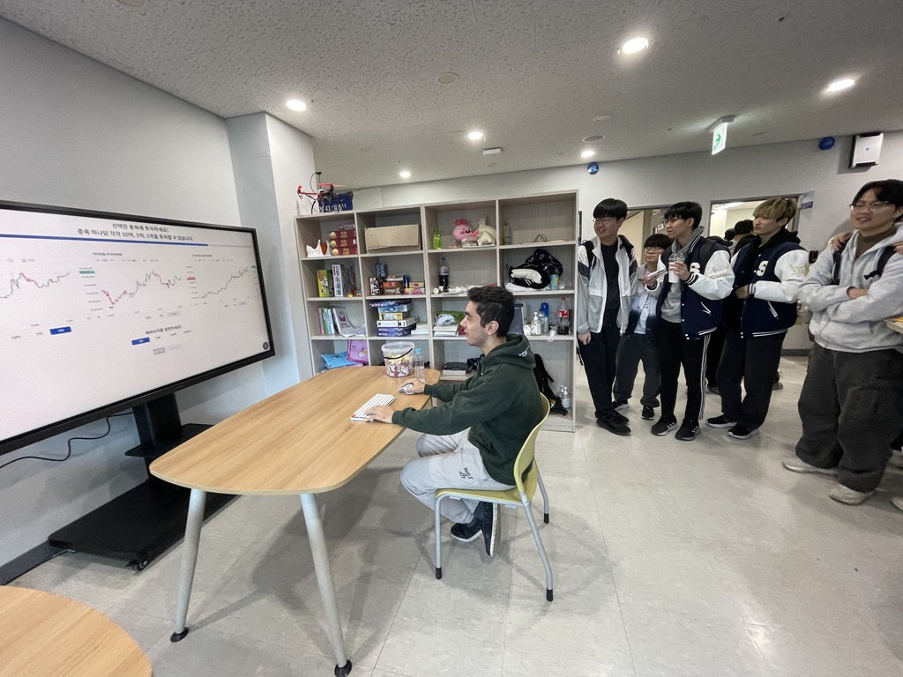
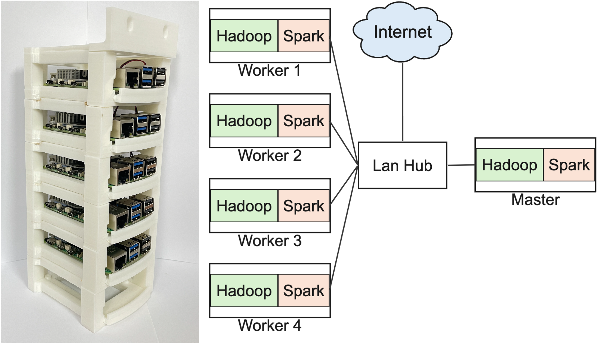
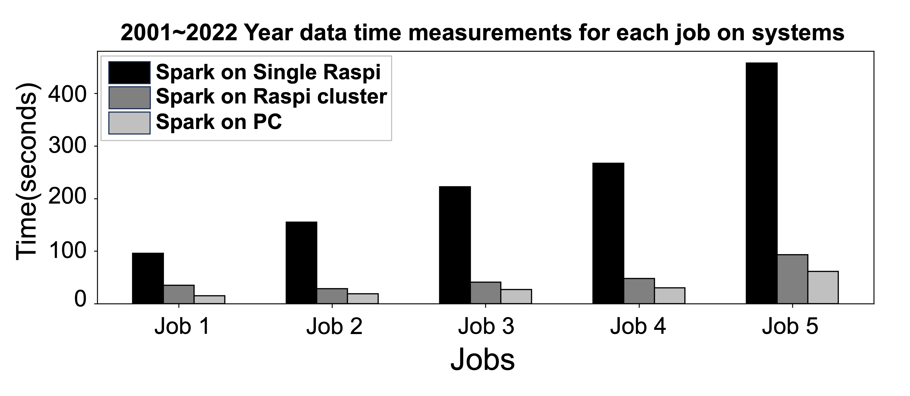
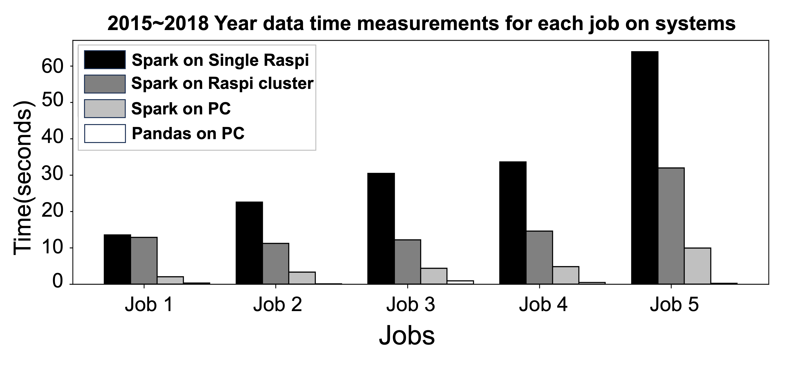
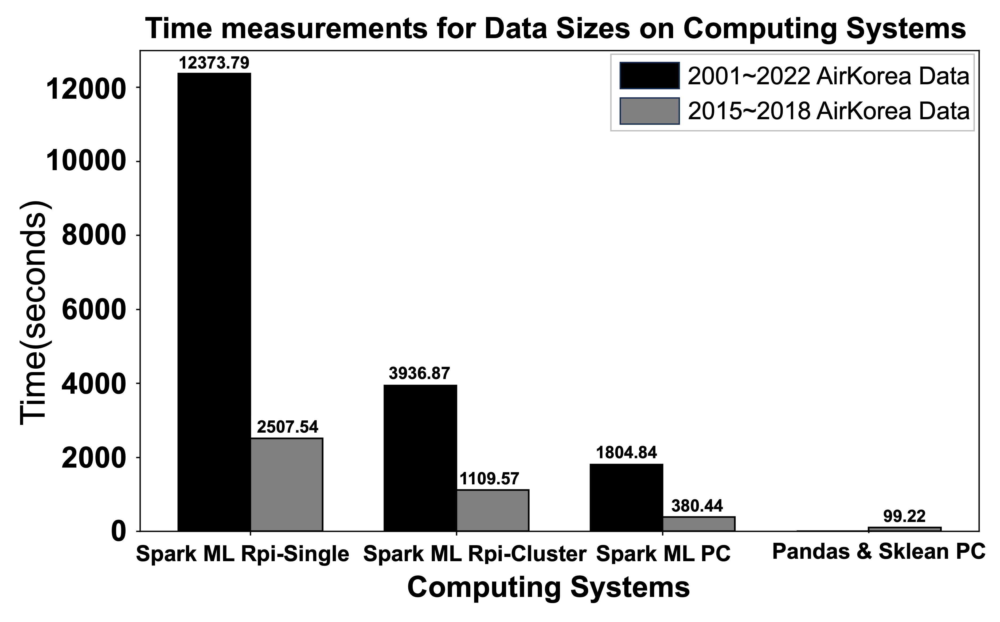
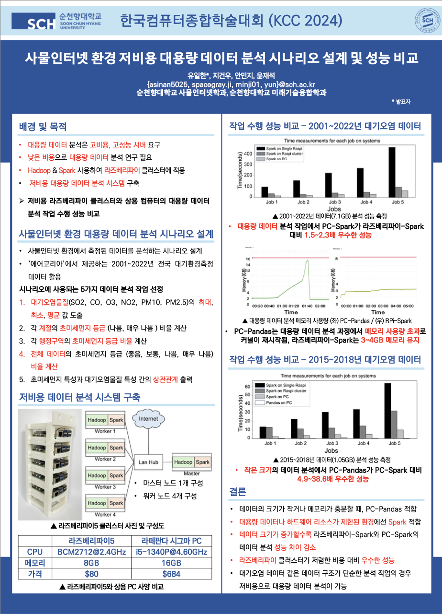

# Ilhan Yu - Data Engineer 

## 📄 Korean Resume: [Korean Resume](https://pear-cart-523.notion.site/512f05abdca74a98963f7d92fe5fe073?pvs=4) / English Resume: [English Resume](assets/IlhanYu_Resume.pdf)

## Recent Projects

### 1. **Cryptocurrency Mock Investment Game**

**Description**: A web-based mock investment game that uses real-time cryptocurrency data for fun and educational investing.

**Tech Stack**:

      

**Key Features**:
- Real-time data ingestion of up to **30,000 records per minute**
- Automated pipeline for data collection and analysis
- **Serverless backend** to reduce costs and simplify management
- To address cloud service cost issues, I replaced AWS EMR with an on-premises distributed computing environment, reducing server costs by **94% ($139.10 → $7 per month)**
- **Won first prize** in a game development contest

#### 🎮 **Game Play: [CoinKing](https://www.coinking.site/signin)**
#### 🔗 **GitHub Repository:** [Organization DE Repo](https://github.com/SCHU-CoinGame/DataEngineering), [Organization BE Repo](https://github.com/SCHU-CoinGame/BackEnd)
#### **More Details:** [Tech Blog Post](https://dont-make-excuses.tistory.com/18)
### **Designed DataPipe Line Architecture**

### **In-Game Screenshot**

### **On-Premise Distributed Cluster Setup** / **Showcased the Game at University**
 

---

### 2. **Large-Scale IoT Data Analysis Paper**
**Paper Link:** [DBpia](https://www.dbpia.co.kr/journal/articleDetail?nodeId=NODE11862340)

**Tech Stack**: 

**Title**: "사물인터넷 환경 저비용 대용량 데이터 분석 시나리오 설계 및 성능 비교"  
**Conference**: KCC2024 *(한국컴퓨터종합학술대회)*

**Key Highlights**:
- Built a **low-cost Raspberry Pi cluster** using Hadoop (HDFS, Yarn) and Spark (DataFrame)
- Collected and analyzed **22-year particulate matter data** from AirKorea
- Compared performance of Spark and Pandas on **Raspberry Pi cluster vs. a standard PC**
- Achieved **Best Student Paper** at the Korean Computer Congress 2024

#### **More Details:** [Tech Blog - Paper Category](https://dont-make-excuses.tistory.com/category/%EB%85%BC%EB%AC%B8)

### **Low-Cost IoT Device Based Cluster Setup**

### **Results:**

I computed the time that took to analyze certain size of data in four different settings. The settings are:
+ Spark on single RPi 
+ Spark on RPi cluster
+ Spark on a normal desktop PC
+ Pandas on a normal desktop PC

> Single RPi could complete the task of analyzing big data, though pandas on a normal desktop PC failed due to OOM. Spark on a normal desktop PC showed the best performance, followed by Spark on RPi cluster, then Spark on single RPi.

> So then I used less amount of data for experiment - Pandas on a normal desktop PC showed best performance, followed by Spark on a normal desktop PC, then Spark on a RPi cluster, and then Spark on single RPi.

> I tried linear regression to predict PM using Scikit-learn and Spark ML. Similar to the experiment result above, when it comes to big data, Pandas and Scikit-learn failed due to OOM, and Spark on RPi cluster succesfully completed machine learning as well as data analysis.

### **Conclusion**

+ Spark on RPi cluster showed fine performance based on relatively low cost
+ Resolved the necessity of costly servers in IoT environments for big data analysis and machine learning

### **KCC2024 Poster**

---

## 💬 About Me
- I’m a **Data Engineer** with experience building real-time data pipelines using **Kafka**, **Spark**, and **Hadoop**.
- I also developed backend services, including **Spring**-based systems and **AWS Lambda/API Gateway**, to ensure scalability and reliability.
- On the frontend side, I’m comfortable with **JavaScript**, **HTML**, and **CSS**.
- For database solutions, I’ve worked with **DynamoDB**, **InfluxDB**, and **MySQL**, focusing on efficient data modeling and queries.
  
**Tech Focus**:
- **Data Engineering**: Kafka, Spark, Hadoop, Designed ELT/ETL Data Pipeline
- **Data Analysis**: Spark DataFrame, Pandas
- **Backend**: Spring, AWS Lambda, API Gateway
- **Frontend**: JavaScript, HTML, CSS
- **Databases**: DynamoDB, InfluxDB, MySQL
---

## 🌱 Mission
> "I aim to use diverse data sources to build practical services that truly solve real-world problems and help people."

Currently, I want to develop a platform that makes it easy for anyone to collect and handle complex data, bridging the gap between raw information and real-life solutions. I hope to focus on accessible data engineering that benefits people’s daily needs without being overly complicated.

---

## 🏆 Achievements
- **Game Development Contest Winner**: Developed a real-time cryptocurrency mock investment game, earning first prize.
- **App Development Contest Winner**: Developed a "1 Dollor Breakfast" users monitoring app, earning first prize.
- **SW Idea Contest Winner**: Suggested the idea of AI special agreement suggestion service for "Jeonse" contracts, earning second prize.
- **Best Student Paper Award at KCC2024**: Authored a paper on low-cost IoT-based big data analysis with Raspberry Pi clusters, Spark & Hadoop.
---

## 🤝 Contact 
- **LinkedIn**: [linkedin.com/in/ilhan-yu](https://www.linkedin.com/in/ilhan-yu-8b3a6b2b9/)
- **Email**: [yih5025@gmail.com](mailto:yih5025@gmail.com)
- **Tech Blog**: [dont-make-excuses](https://dont-make-excuses.tistory.com/)
