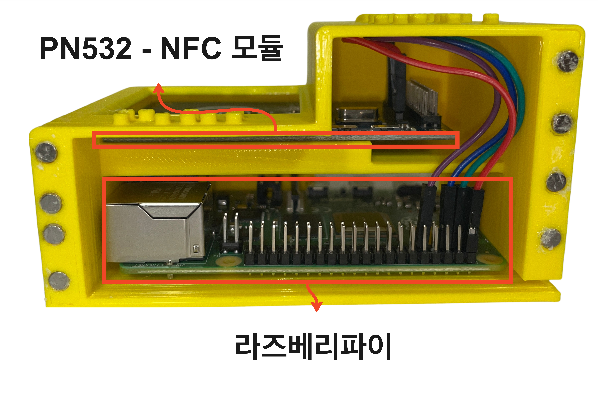

# Ilhan Yu - Data Engineer / Full Stack Developer

**📑 Korean Resume: [Korean Resume](https://pear-cart-523.notion.site/512f05abdca74a98963f7d92fe5fe073?pvs=4) & English Resume: [English Resume](assets/IlhanYu_Resume.pdf)**

## 🛠️ Projects

### 1. **Cryptocurrency Mock Investment Game**

**Description**: A web-based mock investment game that uses real-time cryptocurrency data for fun and educational investing.

**Tech Stack**:

      

**Key Features**:
- Real-time data ingestion of up to **30,000 records per minute**
- Automated pipeline for data collection
- **Serverless backend** to reduce costs and simplify management
- To address cloud service cost issues, I replaced AWS EMR with an on-premises distributed computing environment, reducing server costs by **94% ($139.10 → $7 per month)**
- Collected clickstream data to derive user data analysis

#### 🎥 **Game Demo Video: [Game Video](https://youtu.be/REJ2J8oUgwQ?si=xgPsktEdx1rFc1Sq)**
#### 🎮 **Game Play: [CoinKing](https://www.coinking.site/signin)**
#### 🔗 **GitHub Repository:** [Organization DE Repo](https://github.com/SCHU-CoinGame/DataEngineering), [Organization BE Repo](https://github.com/SCHU-CoinGame/BackEnd)
#### 🏆 **Award: Game Development Contest top prize**
#### **More Details:** [Tech Blog Post](https://dont-make-excuses.tistory.com/18)
### 👨🏻‍🔧 **Designed Data Pipe Line Architecture**

### 📈 **In-Game Screenshot**
 

### **On-Premise Distributed Cluster Setup** / **Showcased the Game at University**
 

---

### 2. **Large-Scale IoT Data Analysis Paper**

#### **Title**: "사물인터넷 환경 저비용 대용량 데이터 분석 시나리오 설계 및 성능 비교"  
#### **Conference**: KCC2024 *(한국컴퓨터종합학술대회)*
#### 🏆 **Award: Best Student Paper Award at KCC2024**

**Tech Stack**: 

**Key Highlights**:
- Built a **low-cost Raspberry Pi cluster** using Hadoop (HDFS, Yarn) and Spark (DataFrame)
- Collected and analyzed **22-year particulate matter data** from AirKorea
- Compared performance of Spark and Pandas on **Raspberry Pi cluster vs. a standard PC**
- Achieved **Best Student Paper** at the Korean Computer Congress 2024

#### **Paper Link:** [DBpia](https://www.dbpia.co.kr/journal/articleDetail?nodeId=NODE11862340)
#### **More Details:** [Tech Blog - Paper Category](https://dont-make-excuses.tistory.com/category/%EB%85%BC%EB%AC%B8)

### **Low-Cost IoT Device Based Cluster Setup**

### **Results:**

I computed the time that took to analyze certain size of data in four different settings. The settings are:
+ Spark on single RPi 
+ Spark on RPi cluster
+ Spark on a normal desktop PC
+ Pandas on a normal desktop PC

> Single RPi could complete the task of analyzing big data, though pandas on a normal desktop PC failed due to OOM. Spark on a normal desktop PC showed the best performance, followed by Spark on RPi cluster, then Spark on single RPi.

> So then I used less amount of data for experiment - Pandas on a normal desktop PC showed best performance, followed by Spark on a normal desktop PC, then Spark on a RPi cluster, and then Spark on single RPi.

> I tried linear regression to predict PM using Scikit-learn and Spark ML. Similar to the experiment result above, when it comes to big data, Pandas and Scikit-learn failed due to OOM, and Spark on RPi cluster succesfully completed machine learning as well as data analysis.

### **Conclusion**

+ Spark on RPi cluster showed fine performance based on relatively low cost
+ Resolved the necessity of costly servers in IoT environments for big data analysis and machine learning

### **KCC2024 Poster**

---

### 3. **The Korean air pollution data Visualization**

**Description:** A web-based application that collects and visualizes air pollution data from Korea’s public API (such as AirKorea). The site displays monthly trends in pollutants—including PM10, PM2.5, SO₂, NO₂, CO, and O₃—and provides users with the latest air quality indices for various regions. This helps users easily compare regional air quality and understand historical pollution patterns.

**Tech Stack**:       

#### **Key Features** 
- **Visualization:** Graphical display of monthly air pollution trends for various regions.
- **Real-Time Data Updates:** Fetches and updates current PM10, PM2.5, and other pollutant data.
- **Regional Comparison:** Compare air quality indices across multiple regions in Korea.
- **Historical Data Analytics:** Analyze past pollution trends and patterns.
- **Seaching Regional Data:** Loads data into MYSQL and displays only data for a specific region in a table format.

#### 🔗 **GitHub Repository:** [Korea Air Pollution Repo](https://github.com/yih5025/Korea-Air-Pollution)

### 💨 **WebPage Screenshot**

---
### 4. **Assistive Device for the Visually Impaired Using NFC, OCR and Object Detection(Voice Memo.)**

**Description:** Voice Memo. is an assistive technology platform designed to help visually impaired individuals easily access information about objects. By leveraging object detection, OCR, and voice recording, the application allows users to capture information about items (via NFC stickers) and listen to audio memos detailing object-specific information.

### 🎥 **Demo Video: [Demo Video](https://youtu.be/uVzv5m8E1PE?si=lztpBMtm8oQlKLba)**

**Tech Stack:**      

#### **Key Features** 
- **Google ML API:** for object detection and OCR  
- **Raspberry Pi & NFC Modules:** for IoT-based voice memo storage  
- **TCP Socket Communication:** for data transfer between devices

#### 🔗 **More Details:** [Tech Blog - VoiceMemo](https://dont-make-excuses.tistory.com/9)

### ⚙️ **3D Modeling / Raspiberry Pi & NFC Module**
 

### **Service Architecture**

### 📱 **App Feature Description**
 

---

## 💬 About Me
- I’m a **Data Engineer** with experience building real-time data pipelines using **Kafka**, **Spark**, and **Hadoop**.
- I also developed backend services, including **Spring**-based systems and **AWS Lambda/API Gateway**, to ensure scalability and reliability.
- On the frontend side, I’m comfortable with **JavaScript**, **HTML**, and **CSS**.
- For database solutions, I’ve worked with **DynamoDB**, **InfluxDB**, and **MySQL**, focusing on efficient data modeling and queries.
  
**Tech Focus**:
- **Data Engineering**: Kafka, Spark, Hadoop, Designed ELT/ETL Data Pipeline
- **Data Analysis**: Spark DataFrame, Pandas
- **Backend**: Spring, AWS Lambda, API Gateway
- **Frontend**: JavaScript, HTML, CSS
- **Databases**: DynamoDB, InfluxDB, MySQL
---

## 🌱 Mission
> "I aim to use diverse data sources to build practical services that truly solve real-world problems and help people."

Currently, I want to develop a platform that makes it easy for anyone to collect and handle complex data, bridging the gap between raw information and real-life solutions. I hope to focus on accessible data engineering that benefits people’s daily needs without being overly complicated.

---

## 🏆 Achievements
- **Game Development Contest Winner**: Developed a real-time cryptocurrency mock investment game, earning top prize.
- **App Development Contest Winner**: Developed a "1 Dollor Breakfast" users monitoring app, earning top prize.
- **SW Idea Contest Winner**: Suggested the idea of AI special agreement suggestion service for "Jeonse" contracts, earning second prize.
- **Best Student Paper Award at KCC2024**: Authored a paper on low-cost IoT-based big data analysis with Raspberry Pi clusters, Spark & Hadoop.
---

## 🤝 Contact 
- **LinkedIn**: [linkedin.com/in/ilhan-yu](https://www.linkedin.com/in/ilhan-yu-8b3a6b2b9/)
- **Email**: [yih5025@gmail.com](mailto:yih5025@gmail.com)
- **Tech Blog**: [dont-make-excuses](https://dont-make-excuses.tistory.com/)
